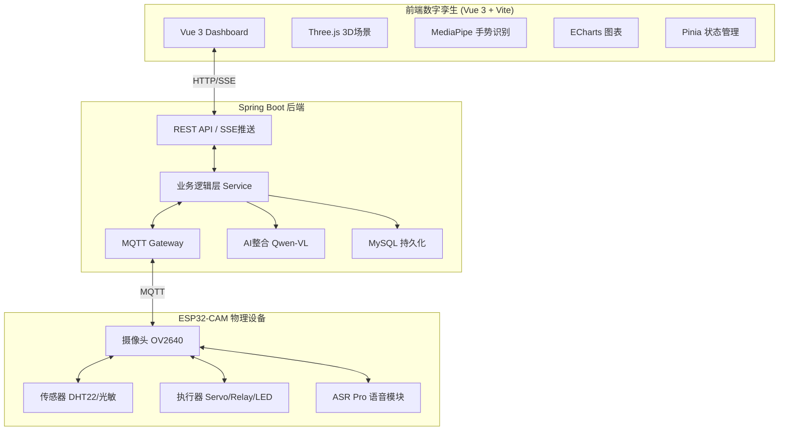

# 🎥 ESP32-CAM 智能物联网平台

> 基于 **ESP32-CAM** + **Spring Boot 3.5** + **Vue 3** + **MQTT** + **AI视觉分析** 的完整物联网系统

    

---

## 📋 项目概述

这是一个功能完善的物联网（IoT）智能监控平台，集成了**远程摄像头控制**、**MJPEG实时视频流**、**温湿度监测**、**智能家居控制**、**AI视觉问答**和**3D数字孪生可视化**。系统采用 MQTT 协议实现设备与服务器的双向实时通信，并通过 SSE（Server-Sent Events）实现前端实时数据推送。

### 🎯 核心特性

- 🖥️ **3D 数字孪生**：Three.js 构建完整的 ESP32-CAM 硬件模型，状态实时同步
- 🧠 **AI 深度融合**：集成 Qwen-VL 大模型，支持视觉问答和智能自动化
- 🎨 **现代化 UI**：Glassmorphism 风格深色主题，ECharts 实时图表监控
- 👋 **手势控制**：MediaPipe Hands 隔空手势交互
- 🎙️ **语音控制**：ASR PRO 硬件级离线语音识别

---

## 🚀 功能清单

### 一、摄像头功能 📷

| 功能 | 说明 | API/调用方式 |
|------|------|-------------|
| **1080p 高清拍照** | 远程触发拍照，自动上传到服务器 | `POST /mqtt/capture/{clientId}` |
| **MJPEG 视频流** | 720p 实时推流，支持浏览器/VLC播放 | `http://{ESP32_IP}/stream` |
| **多分辨率切换** | 支持 320×240 / 480p / 720p / 1080p | `POST /mqtt/stream-resolution/{clientId}` |
| **20+ 参数调节** | 亮度、对比度、饱和度、特效、白平衡等 | `POST /mqtt/param/{clientId}` |

<details>
<summary>📸 摄像头参数完整列表</summary>

| 参数名 | 说明 | 取值范围 |
|--------|------|----------|
| `brightness` | 亮度 | -2 ~ 2 |
| `contrast` | 对比度 | -2 ~ 2 |
| `saturation` | 饱和度 | -2 ~ 2 |
| `sharpness` | 锐度 | -2 ~ 2 |
| `quality` | JPEG质量 | 0-63 (越小越好) |
| `special_effect` | 特效 | 0=无, 1=负片, 2=黑白, 3=复古, 4=蓝调, 5=绿调 |
| `awb` | 自动白平衡 | 0=关, 1=开 |
| `wb_mode` | 白平衡模式 | 0=自动, 1=晴天, 2=阴天... |
| `aec` | 自动曝光 | 0=关, 1=开 |
| `ae_level` | 曝光补偿 | -2 ~ 2 |
| `agc` | 自动增益 | 0=关, 1=开 |
| `hmirror` | 水平镜像 | 0=关, 1=开 |
| `vflip` | 垂直翻转 | 0=关, 1=开 |
| `bpc` | 黑点校正 | 0=关, 1=开 |
| `wpc` | 白点校正 | 0=关, 1=开 |
| `lenc` | 镜头校正 | 0=关, 1=开 |
| `framesize` | 分辨率 | 5=QVGA, 7=480p, 10=720p, 13=1080p |

</details>

---

### 二、LED 控制 💡

| 功能 | 说明 | API |
|------|------|-----|
| **闪光灯开关** | GPIO4 白色 LED，支持开关切换 | `POST /mqtt/led/{clientId}` `{"value": 1}` |
| **PWM 亮度调节** | 0-255 级无极调光 | `POST /mqtt/led-brightness/{clientId}` `{"brightness": 128}` |
| **红色指示灯** | GPIO33 红色 LED，状态指示 | `POST /mqtt/red-led/{clientId}` `{"value": 1}` |

---

### 三、窗户控制（SG90 舵机）🪟

| 功能 | 说明 | API |
|------|------|-----|
| **全开** | 舵机转到 180° | `POST /mqtt/servo/{clientId}` `{"angle": 180}` |
| **半开** | 舵机转到 90° | `POST /mqtt/servo/{clientId}` `{"angle": 90}` |
| **小开** | 舵机转到 45° | `POST /mqtt/servo/{clientId}` `{"angle": 45}` |
| **关闭** | 舵机转到 0° | `POST /mqtt/servo/{clientId}` `{"angle": 0}` |
| **自定义角度** | 任意 0-180° | `POST /mqtt/servo/{clientId}` `{"angle": N}` |

---

### 四、风扇控制（继电器）🌀

| 功能 | 说明 | API |
|------|------|-----|
| **开启** | 继电器吸合，风扇转动 | `POST /mqtt/relay/{clientId}` `{"on": true}` |
| **关闭** | 继电器释放，风扇停止 | `POST /mqtt/relay/{clientId}` `{"on": false}` |

---

### 五、环境监测 🌡️

#### 温湿度监测（DHT22）

| 功能 | 说明 | API/方式 |
|------|------|----------|
| **实时数据采集** | 可配置间隔 1-60 秒 | SSE 推送 `/mqtt/dht/sse/{clientId}` |
| **历史数据图表** | ECharts 可视化 | `GET /mqtt/dht/dashboard/{clientId}` |
| **采集间隔设置** | 远程动态配置 | `POST /mqtt/dht-interval/{clientId}` `{"interval": 5000}` |

#### 光照监控（光敏电阻）

| 功能 | 说明 | 数据 |
|------|------|------|
| **明暗检测** | 读取 DO 数字输出判断环境亮度 | `lightDark`: true=暗, false=亮 |
| **实时推送** | 随温湿度一起通过 SSE 推送 | DHT 事件中包含 `lightDark` |

---

### 六、语音控制（ASR PRO）🎙️

| 语音指令 | 功能 | 串口输出 |
|----------|------|----------|
| **"开灯"** | LED 开 | `CMD:LED_ON` |
| **"关灯"** | LED 关 | `CMD:LED_OFF` |
| **"灯光最亮"** | LED 亮度 255 | `CMD:LED_MAX` |
| **"灯光中等"** | LED 亮度 128 | `CMD:LED_MID` |
| **"开指示灯"** | 红灯开 | `CMD:RLED_ON` |
| **"关指示灯"** | 红灯关 | `CMD:RLED_OFF` |
| **"开窗"** | 舵机 180° | `CMD:WIN_OPEN` |
| **"关窗"** | 舵机 0° | `CMD:WIN_CLOSE` |
| **"打开风扇"** | 继电器开 | `CMD:FAN_ON` |
| **"关闭风扇"** | 继电器关 | `CMD:FAN_OFF` |
| **"拍照"** | 1080p 拍照 | `CMD:CAPTURE` |

---

### 七、设备状态监控 📊

| 功能 | 说明 | API/方式 |
|------|------|----------|
| **实时状态** | 运行时间、空闲内存、WiFi 信号、分辨率 | SSE 推送 `/mqtt/sse/{clientId}` |
| **状态历史图表** | RSSI 和内存双 Y 轴折线图 | `GET /mqtt/status-history/chart/{clientId}` |
| **数据持久化** | MySQL 数据库存储 | 自动保存 |

**状态 JSON 结构：**
```json
{
  "clientId": "esp32cam",
  "uptime": 1234,
  "freeHeap": 152536,
  "rssi": -43,
  "ledStatus": false,
  "ledBrightness": 128,
  "redLedStatus": false,
  "servoAngle": 90,
  "relayStatus": false,
  "framesize": 11
}
```

---

### 八、设备配置管理 ⚙️

| 功能 | 说明 | API |
|------|------|-----|
| **WiFi 配置** | 远程修改 WiFi（自动重启） | `POST /mqtt/config/wifi/{clientId}` |
| **MQTT 配置** | 修改 Broker 地址/端口 | `POST /mqtt/config/mqtt/{clientId}` |
| **上传 URL 设置** | 立即生效无需重启 | `POST /mqtt/config/upload-url/{clientId}` |
| **配置查询** | 获取当前完整配置 | `POST /mqtt/cam/{clientId}/get_config` |
| **恢复默认** | 重置为出厂配置 | `POST /mqtt/config/reset/{clientId}` |
| **状态上报间隔** | 10 秒 - 5 分钟可调 | `POST /mqtt/cam/{clientId}/set_status_interval` |

---

### 九、AI 智能功能 🧠

| 功能 | 说明 | API |
|------|------|-----|
| **视觉问答** | 拍照并分析"这是什么"等多轮对话 | `POST /ai/chat/{clientId}` |
| **图片分析** | 分析指定图片内容 | `POST /ai/analyze` |
| **对话历史** | 获取/清空会话历史 | `GET/DELETE /ai/history/{sessionId}` |
| **智能自动化** | 基于传感器数据触发场景（过热开风扇等） | 后端自动化配置 |

> **AI 模型**: 阿里云 Qwen-VL 视觉语言大模型

---

### 十、3D 数字孪生与可视化 🖥️

| 功能 | 说明 |
|------|------|
| **Three.js 3D 场景** | ESP32-CAM 硬件完整建模，实时状态同步 |
| **手势控制** | MediaPipe Hands：双指查看数据、张手旋转、捏合缩放 |
| **ECharts 图表** | 温湿度趋势、设备状态实时监控 |
| **Dock 栏导航** | Mac 风格底部控制栏 |
| **实时天气** | 顶部动态天气组件 |

---

## 🏗️ 系统架构



---

## 📁 项目结构

```
IOT/
├── CameraWebServer/               # ESP32-CAM 固件 (C++/Arduino)
│   ├── CameraWebServer.ino        # 主程序入口
│   ├── config.h                   # 全局配置和声明
│   ├── config_manager.cpp         # 配置管理（NVS Flash读写）
│   ├── mqtt_handler.cpp           # MQTT 双向通信处理
│   ├── camera_control.cpp         # 摄像头拍照和参数控制
│   ├── led_control.cpp            # LED/指示灯控制
│   ├── dht_sensor.cpp             # DHT22 温湿度传感器
│   ├── servo_control.cpp          # SG90 舵机控制（窗户）
│   ├── relay_control.cpp          # 继电器控制（风扇）
│   ├── light_sensor.cpp           # 光敏传感器
│   ├── asr_handler.cpp            # ASR PRO 语音模块
│   ├── status_publisher.cpp       # 状态发布
│   └── app_httpd.cpp              # HTTP 视频流服务器
│
├── SpringbootIOT/                 # Spring Boot 后端 (Java)
│   ├── controller/                # REST API 接口
│   │   ├── CamController.java     # 摄像头和设备控制接口
│   │   ├── AiChatController.java  # AI 对话接口
│   │   ├── SseController.java     # SSE 实时推送
│   │   └── ...
│   ├── service/                   # 业务逻辑层
│   ├── configuration/             # MQTT 和定时任务配置
│   ├── mapper/                    # MyBatis-Plus 数据访问
│   ├── pojo/                      # 实体类和请求对象
│   └── utils/                     # 工具类
│
├── iot-datav/                     # 前端数字孪生 (Vue 3 + Vite)
│   ├── src/components/three/      # Three.js 3D 场景
│   ├── src/components/panels/     # 监控与控制面板
│   ├── src/components/controls/   # 手势交互组件
│   ├── src/components/modals/     # 弹窗组件（AI助手等）
│   ├── src/composables/           # 组合式函数（SSE等）
│   └── src/stores/                # Pinia 状态管理
│
├── test-panel/                    # 开发测试面板 (HTML/JS/CSS)
│   ├── test-panel.html            # 测试面板界面
│   ├── test-panel.js              # 测试逻辑脚本
│   └── test-panel.css             # 样式文件
│
└── libraries/                     # ESP32 依赖库
    ├── ArduinoJson/               # JSON 解析库 6.21.3
    ├── PubSubClient/              # MQTT 客户端库 2.8
    ├── DHT_sensor_library/        # DHT 传感器库
    └── Adafruit_Unified_Sensor/   # 传感器统一接口
```

---

## 🔧 技术栈

### 固件层 (ESP32-CAM)
- **开发板**: ESP32-CAM + OV2640
- **框架**: Arduino ESP32 3.3.3
- **通信**: PubSubClient 2.8 (MQTT)
- **数据格式**: ArduinoJson 6.21.3
- **存储**: Preferences (NVS Flash)
- **硬件**: DHT22、SG90舵机、继电器、光敏传感器、ASR PRO

### 后端 (SpringbootIOT)
- **框架**: Spring Boot 3.5.0
- **通信**: Spring Integration MQTT、SSE
- **数据库**: MyBatis-Plus + MySQL
- **AI**: 阿里云 ModelScope SDK (Qwen-VL)

### 前端 (iot-datav)
- **核心框架**: Vue 3 (Composition API) + Vite
- **3D 引擎**: Three.js
- **图表库**: ECharts 5
- **AI 交互**: MediaPipe Hands (手势识别)
- **状态管理**: Pinia
- **通信**: SSE + Axios

---

## 📊 MQTT 主题设计

| 主题 | 方向 | 说明 |
|------|------|------|
| `cam/{clientId}/cmd` | 后端 → 设备 | 控制指令下发 |
| `cam/{clientId}/result` | 设备 → 后端 | 指令执行结果 |
| `cam/{clientId}/status` | 设备 → 后端 | 设备状态上报 |
| `cam/{clientId}/dht` | 设备 → 后端 | 温湿度数据上报 |
| `cam/{clientId}/config` | 设备 → 后端 | 完整配置上报 |

---