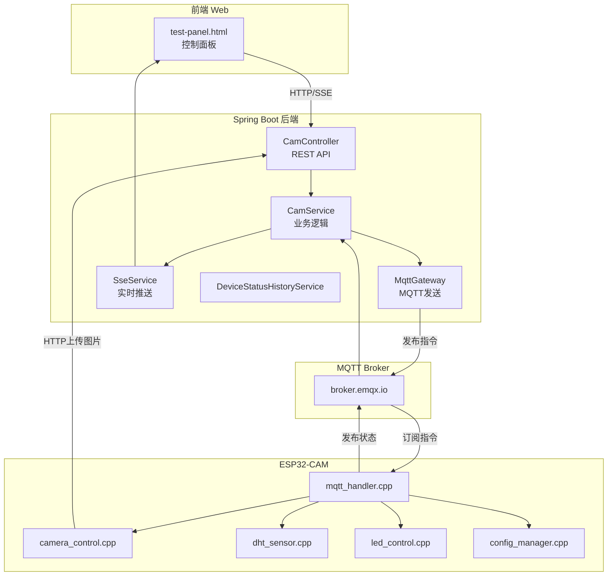

# 🎥 ESP32-CAM 物联网智能摄像头平台

> 基于 **ESP32-CAM** + **Spring Boot** + **MQTT** 的完整物联网系统

## 📋 项目概述

这是一个功能完善的物联网(IoT)平台，支持**远程摄像头控制**、**温湿度监测**、**实时视频推流**和**设备管理**。通过MQTT协议实现设备与服务器的双向通信，并提供友好的Web控制面板。

---

## 🚀 功能清单

### 📷 摄像头功能

| 功能 | 说明 | API/调用方式 |
|------|------|-------------|
| **1080p高清拍照** | 远程触发拍照，自动上传到服务器 | `POST /mqtt/capture/{clientId}` |
| **MJPEG视频流** | 720p实时推流，支持浏览器/VLC播放 | `http://{ESP32_IP}/stream` |
| **分辨率切换** | 支持480p/720p/1080p切换 | `POST /mqtt/stream-resolution/{clientId}` |
| **参数调整** | 亮度/对比度/饱和度/特效/质量等 | `POST /mqtt/param/{clientId}` |

**摄像头参数列表：**

| 参数名 | 说明 | 取值范围 |
|--------|------|----------|
| `brightness` | 亮度 | -2 ~ 2 |
| `contrast` | 对比度 | -2 ~ 2 |
| `saturation` | 饱和度 | -2 ~ 2 |
| `sharpness` | 锐度 | -2 ~ 2 |
| `quality` | JPEG质量 | 0-63 (越小越好) |
| `special_effect` | 特效 | 0=无, 1=负片, 2=黑白, 3=红调... |
| `awb` | 自动白平衡 | 0=关, 1=开 |
| `wb_mode` | 白平衡模式 | 0=自动, 1=晴天, 2=阴天... |
| `aec` | 自动曝光 | 0=关, 1=开 |
| `ae_level` | 曝光补偿 | -2 ~ 2 |
| `agc` | 自动增益 | 0=关, 1=开 |
| `hmirror` | 水平镜像 | 0=关, 1=开 |
| `vflip` | 垂直翻转 | 0=关, 1=开 |
| `framesize` | 分辨率 | 7=480p, 11=720p, 14=1080p |

---

### 💡 LED 控制

| 功能 | 说明 | API |
|------|------|-----|
| **闪光灯开关** | GPIO4白色LED，切换开关 | `POST /mqtt/led/{clientId}` body: `{"value": 1}` |
| **PWM亮度调节** | 0-255级亮度 | `POST /mqtt/led-brightness/{clientId}` body: `{"brightness": 128}` |
| **红色指示灯** | GPIO33红色LED，切换开关 | `POST /mqtt/red-led/{clientId}` body: `{"value": 1}` |

---

### 🪟 窗户控制 (SG90舵机)

| 功能 | 说明 | API |
|------|------|-----|
| **全开** | 舵机转到180° | `POST /mqtt/servo/{clientId}` body: `{"angle": 180}` |
| **半开** | 舵机转到90° | `POST /mqtt/servo/{clientId}` body: `{"angle": 90}` |
| **小开** | 舵机转到45° | `POST /mqtt/servo/{clientId}` body: `{"angle": 45}` |
| **关闭** | 舵机转到0° | `POST /mqtt/servo/{clientId}` body: `{"angle": 0}` |
| **自定义角度** | 任意0-180°角度 | `POST /mqtt/servo/{clientId}` body: `{"angle": 数值}` |

> 硬件接线: SG90舵机信号线接GPIO14，红线接5V，棕线接GND

---

### 🌡️ 温湿度监测 (DHT22)

| 功能 | 说明 | API/方式 |
|------|------|----------|
| **实时数据采集** | 可配置间隔(1-60秒) | SSE实时推送 `/mqtt/dht/sse/{clientId}` |
| **历史数据图表** | Chart.js可视化 | `GET /mqtt/dht/dashboard/{clientId}` |
| **采集间隔设置** | 远程配置 | `POST /mqtt/dht-interval/{clientId}` body: `{"interval": 5000}` |

---

### 📊 设备状态监控

| 功能 | 说明 | API/方式 |
|------|------|----------|
| **实时状态** | 运行时间/空闲内存/WiFi信号/分辨率 | SSE推送 `/mqtt/sse/{clientId}` |
| **状态历史图表** | RSSI和内存双Y轴折线图 | `GET /mqtt/status-history/chart/{clientId}` |
| **数据持久化** | 存入MySQL数据库 | 自动保存 |

**状态JSON结构：**
```json
{
  "clientId": "esp32cam",
  "uptime": 1234,
  "freeHeap": 152536,
  "rssi": -43,
  "ledStatus": false,
  "ledBrightness": 128,
  "redLedStatus": false,
  "framesize": 11
}
```

---

### ⚙️ 设备配置管理

| 功能 | 说明 | API |
|------|------|-----|
| **WiFi配置** | 远程修改WiFi(自动重启) | `POST /mqtt/config/wifi/{clientId}` |
| **MQTT配置** | 修改Broker地址/端口 | `POST /mqtt/config/mqtt/{clientId}` |
| **上传URL设置** | 立即生效无需重启 | `POST /mqtt/config/upload-url/{clientId}` |
| **配置查询** | 获取当前配置 | `POST /mqtt/cam/{clientId}/get_config` |
| **恢复默认** | 重置为出厂配置 | `POST /mqtt/config/reset/{clientId}` |
| **状态上报间隔** | 10秒-5分钟 | `POST /mqtt/cam/{clientId}/set_status_interval` |

---

## 🏗️ 系统架构



---

## 📁 项目结构

```
IOT/
├── CameraWebServer/              # ESP32-CAM固件 (模块化设计)
│   ├── CameraWebServer.ino       # 主程序入口
│   ├── config.h                  # 全局配置和声明
│   ├── config_manager.cpp        # Flash配置读写 (Preferences)
│   ├── mqtt_handler.cpp          # MQTT连接和消息处理
│   ├── camera_control.cpp        # 摄像头拍照和参数调整
│   ├── led_control.cpp           # LED和指示灯控制
│   ├── dht_sensor.cpp            # DHT22温湿度传感器
│   ├── status_publisher.cpp      # 状态发布
│   ├── app_httpd.cpp             # MJPEG视频流服务器
│   └── board_config.h            # 开发板型号配置
│
├── SpringbootIOT/                # Spring Boot后端
│   ├── src/main/java/com/springboot/
│   │   ├── controller/           # REST API控制器
│   │   │   ├── CamController.java         # 摄像头/LED/配置API
│   │   │   ├── DhtDataController.java     # 温湿度数据API
│   │   │   ├── SseController.java         # SSE实时推送
│   │   │   ├── OperationLogController.java # 操作日志
│   │   │   └── DeviceStatusHistoryController.java
│   │   ├── service/              # 业务逻辑层
│   │   ├── pojo/                 # 数据实体类
│   │   │   ├── Query/            # 请求DTO (带验证)
│   │   │   └── vo/               # 响应VO
│   │   └── configuration/        # MQTT/拦截器配置
│   └── sql/schema.sql            # 数据库建表脚本
│
├── test-panel/                   # Web测试面板
│   ├── test-panel.html           # 主页面
│   ├── test-panel.js             # 逻辑代码 (~1400行)
│   └── test-panel.css            # 样式
│
└── libraries/                    # Arduino依赖库
    ├── ArduinoJson/              # v6.21.3 - JSON解析
    ├── PubSubClient/             # v2.8 - MQTT客户端
    ├── DHT_sensor_library/       # DHT22传感器库
    └── Adafruit_Unified_Sensor/  # 传感器基础库
```

---

## 🔧 技术栈

### 硬件
- **ESP32-CAM AI-Thinker** - 双核240MHz, 4MB PSRAM
- **OV2640摄像头** - 200万像素
- **DHT22传感器** - 温湿度采集 (GPIO13)
- **闪光灯LED** - GPIO4 (PWM控制)
- **红色指示灯** - GPIO33

### ESP32固件
| 组件 | 版本 | 用途 |
|------|------|------|
| ESP32 Arduino Core | 3.3.3 | 开发框架 |
| ArduinoJson | 6.21.3 | JSON解析 |
| PubSubClient | 2.8 | MQTT客户端 |
| Preferences | 内置 | Flash配置持久化 |
| DHT库 | - | 温湿度传感器 |

### Spring Boot后端
| 组件 | 版本 | 用途 |
|------|------|------|
| Spring Boot | 3.5.0 | 后端框架 |
| Java | 17+ | 运行时 |
| spring-integration-mqtt | - | MQTT集成 |
| MyBatis-Plus | 3.5.7 | 数据库ORM |
| MySQL | - | 数据持久化 |

### 前端
- **原生HTML/CSS/JavaScript**
- **Chart.js 4.4.1** - 图表可视化
- **SSE (Server-Sent Events)** - 实时推送

---

## 📡 MQTT协议详解

### Topic结构
```
cam/{clientId}/cmd      # 后端 → ESP32 (下行指令)
cam/{clientId}/result   # ESP32 → 后端 (执行结果)
cam/{clientId}/status   # ESP32 → 后端 (设备状态)
cam/{clientId}/dht      # ESP32 → 后端 (温湿度)
cam/{clientId}/config   # ESP32 → 后端 (完整配置)
```

### 指令消息格式
```json
{"id": 5741231234, "op": "capture", "val": 0}
```
- `id`: 命令ID (10位数字，32位long范围内)
- `op`: 操作类型
- `val`: 参数值

**支持的操作类型 (op)：**
| op | 说明 | val含义 |
|----|------|---------|
| `capture` | 拍照上传 | 无 |
| `led` | 闪光灯开关 | 0=关, 1=开 |
| `led_brightness` | 闪光灯亮度 | 0-255 |
| `red_led` | 红色指示灯 | 0=关, 1=开 |
| `framesize` | 分辨率 | 7/11/14 |
| `brightness` | 亮度 | -2~2 |
| `contrast` | 对比度 | -2~2 |
| `saturation` | 饱和度 | -2~2 |
| `set_wifi` | WiFi配置 | 需ssid/password字段 |
| `set_mqtt` | MQTT配置 | 需server/port字段 |
| `set_upload_url` | 上传URL | 需url字段 |
| `get_config` | 查询配置 | 无 |
| `reset_config` | 恢复默认 | 无 |
| `set_dht_interval` | DHT采集间隔 | 毫秒(1000-60000) |
| `set_status_interval` | 状态上报间隔 | 毫秒(10000-300000) |

### 结果消息格式
```json
{"id": 5741231234, "ok": true, "info": "上传成功"}
```

---

## 🚀 快速开始

### 1. 数据库初始化
```sql
-- 执行 SpringbootIOT/sql/schema.sql
CREATE TABLE IF NOT EXISTS device_status_history (
    id BIGINT PRIMARY KEY AUTO_INCREMENT,
    client_id VARCHAR(64) NOT NULL,
    rssi INT NOT NULL,
    free_heap INT NOT NULL,
    uptime BIGINT NOT NULL,
    create_time DATETIME NOT NULL DEFAULT CURRENT_TIMESTAMP,
    INDEX idx_client_id (client_id),
    INDEX idx_create_time (create_time)
);
```

### 2. ESP32-CAM固件配置

修改 `config.h`:
```cpp
#define DEFAULT_WIFI_SSID "你的WiFi名称"
#define DEFAULT_WIFI_PASS "你的WiFi密码"
#define DEFAULT_UPLOAD_URL "http://你的后端IP:8080/mqtt/cam/upload"
```

Arduino IDE配置:
- 开发板: `ESP32 Wrover Module`
- 分区方案: `Huge APP (3MB No OTA/1MB SPIFFS)`
- 波特率: 115200

### 3. 启动后端
```bash
cd SpringbootIOT
mvn spring-boot:run
```

### 4. 使用测试面板
1. 打开 `test-panel/test-panel.html`
2. 配置后端地址和设备ID
3. 输入ESP32的IP地址启动视频流

---

## 📊 API调用示例

### 拍照
```bash
curl -X POST http://localhost:8080/mqtt/capture/esp32cam
```

### LED控制
```bash
# 开灯
curl -X POST http://localhost:8080/mqtt/led/esp32cam \
  -H "Content-Type: application/json" \
  -d '{"value": 1}'

# 设置亮度
curl -X POST http://localhost:8080/mqtt/led-brightness/esp32cam \
  -H "Content-Type: application/json" \
  -d '{"brightness": 200}'
```

### 摄像头参数
```bash
# 调整亮度
curl -X POST http://localhost:8080/mqtt/param/esp32cam \
  -H "Content-Type: application/json" \
  -d '{"name": "brightness", "value": 1}'

# 切换分辨率
curl -X POST http://localhost:8080/mqtt/stream-resolution/esp32cam \
  -H "Content-Type: application/json" \
  -d '{"framesize": 11}'  # 720p
```

### 查询配置
```bash
curl -X POST http://localhost:8080/mqtt/cam/esp32cam/get_config
```

---

## 📊 性能指标

| 指标 | 数值 |
|------|------|
| 1080p拍照时间 | 2-3秒 |
| 图片大小 | 150-250KB |
| 720p视频流帧率 | 15-25 FPS |
| MQTT延迟 | <100ms |
| DHT22采样间隔 | 1-60秒 |
| ESP32空闲内存 | ~150KB |

---

## 🔑 代码调用关系

### ESP32端流程
```
MQTT消息 → mqttCallback() → handleCommand()
                              ├── captureAndUpload() → uploadImage()
                              ├── controlLED() / setLEDBrightness()
                              ├── controlRedLED()
                              ├── setCameraParam()
                              ├── saveWiFiConfig() → ESP.restart()
                              ├── saveMQTTConfig() → ESP.restart()
                              ├── saveUploadUrl()
                              ├── publishConfig()
                              └── publishResult()
```

### 后端流程
```
HTTP请求 → CamController → CamService
                            ├── generateCmdId()
                            ├── MqttGateway.send()
                            └── → MQTT Broker → ESP32
```

---

## 📝 版本信息

- **版本**: 2.3.0
- **最后更新**: 2025-12-15
- **开发者**: IOT Project Team

### 更新日志

**v2.3.0** (2025-12-15)
- 📄 重新整理README文档
- 📋 完善功能清单和API说明
- 🔧 整理代码调用关系

**v2.2.0** (2025-12-11)
- 🔧 ESP32固件拆分为8个模块化文件
- 📊 新增设备状态历史数据存储和图表展示
- 🔄 LED按钮改为开关切换模式
- 📦 后端Map改为DTO/VO实体类

---

## 📄 相关文档

- [项目架构详解](项目架构详解.md) - 完整的代码解析
- [使用指南](使用指南.md) - API使用教程
- [配置管理测试](配置管理测试.md) - 配置功能说明
- [操作日志功能说明](操作日志功能说明.md) - 日志系统

---

## 📌 技术要点总结

### 1. cmdId生成 (32位long限制)
```java
// Java端生成10位数字，确保不超出ESP32 32位long范围
private long generateCmdId() {
    long timestamp = System.currentTimeMillis();
    int timePart = (int)(timestamp % 1000000);
    int randomPart = (int)(Math.random() * 10000);
    return timePart * 10000L + randomPart;  // 5741231234
}
```

### 2. HTTP与MQTT连接隔离
```cpp
// MQTT使用全局client
WiFiClient espClient;
PubSubClient mqttClient(espClient);

// HTTP上传使用独立client
void uploadImage() {
    WiFiClient httpClient;  // 独立客户端，避免冲突
    HTTPClient http;
    http.begin(httpClient, upload_url);
}
```

### 3. 配置持久化 (Preferences)
```cpp
// 保存到ESP32 Flash
preferences.begin("esp32cam", false);
preferences.putString("wifi_ssid", ssid);
preferences.end();
ESP.restart();  // 重启应用新配置
```

---

## 📄 许可证

本项目仅供学习交流使用。
