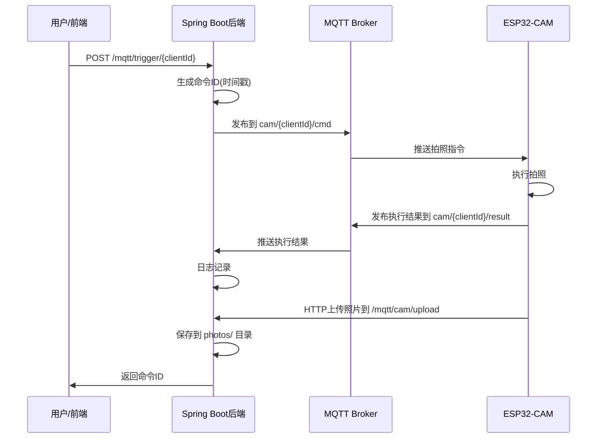

# ESP32-CAM 物联网项目

## 📖 项目概述

这是一个基于 **ESP32-CAM** 和 **Spring Boot** 的物联网(IoT)项目，实现了通过MQTT协议进行远程摄像头控制和图像上传的功能。

### 核心功能
- 🎥 **远程拍照控制**：通过MQTT向ESP32-CAM发送拍照指令，自动拍摄1080p高清照片并上传
- 💡 **LED智能控制**：支持LED开关控制和256级PWM亮度调节
- 📷 **摄像头参数调整**：远程调整亮度、对比度、饱和度、分辨率等参数
- 📤 **图像上传**：ESP32-CAM拍摄的照片通过HTTP自动上传到后端服务器
- 🔄 **MQTT双向通信**：使用MQTT协议实现设备与服务器之间的指令下发和状态/结果上报
- 📡 **720p视频流**：ESP32-CAM提供实时MJPEG视频流，支持浏览器和VLC播放器观看
- 📊 **设备状态监控**：实时获取设备运行时间、内存使用、WiFi信号强度等状态信息

---

## 🏗️ 项目架构

```
IOT/
├── CameraWebServer/          # ESP32-CAM固件代码 (Arduino)
│   ├── CameraWebServer.ino   # 主程序入口
│   ├── app_httpd.cpp         # HTTP服务器和摄像头控制
│   ├── board_config.h        # 开发板型号配置 (AI-Thinker)
│   ├── camera_pins.h         # 摄像头引脚定义
│   └── camera_index.h        # Web界面HTML
│
├── SpringbootIOT/            # Spring Boot 后端服务
│   ├── src/main/java/com/springboot/
│   │   ├── configuration/    # 配置类
│   │   │   ├── MqttConfig.java       # MQTT连接配置
│   │   │   ├── MqttGateway.java      # MQTT消息发送接口
│   │   │   └── Blocker.java          # HTTP拦截器
│   │   ├── controller/
│   │   │   └── CamController.java    # 摄像头控制API
│   │   ├── service/
│   │   │   ├── CamService.java       # 服务接口
│   │   │   └── Impl/
│   │   │       └── CamServiceImpl.java  # MQTT消息处理
│   │   └── pojo/
│   │       └── ResultDto.java        # 结果数据传输对象
│   └── resources/
│       └── application.yml    # 应用配置文件
│
└── libraries/                # Arduino依赖库
    ├── ArduinoJson/          # JSON解析库 (v6.21.3)
    └── PubSubClient/         # MQTT客户端库 (v2.8)
```

---

## 🔧 技术栈

### 硬件
- **ESP32-CAM AI-Thinker 开发板**
  - ESP32-S 芯片(双核 240MHz)
  - 内置 OV2640 摄像头(200万像素)
  - 4MB PSRAM
  - Wi-Fi 802.11b/g/n
  - 蓝牙 4.2

### ESP32-CAM 固件
- **开发环境**: Arduino IDE
- **核心库**:
  - `esp_camera.h` - ESP32摄像头驱动
  - `WiFi.h` - Wi-Fi连接
  - `ArduinoJson` 6.21.3 - JSON数据处理
  - `PubSubClient` 2.8 - MQTT协议通信
  - `esp32` 3.3.3 - ESP32核心库

### Spring Boot 后端
- **框架**: Spring Boot 3.5.0
- **JDK版本**: Java 17
- **核心依赖**:
  - `spring-boot-starter-web` - Web服务
  - `spring-boot-starter-integration` - 企业集成
  - `spring-integration-mqtt` - MQTT支持
  - `mybatis-plus` 3.5.7 - 数据库ORM
  - `lombok` - 简化实体类
  - `paho.client.mqttv3` 1.2.5 - MQTT客户端

### 通信协议
- **MQTT Broker**: `broker.emqx.io:1883` (公共测试代理)
- **HTTP**: 文件上传和Web服务

---

## 📡 MQTT 通信协议

### Topic 结构
```
cam/{clientId}/cmd      # 服务器 → ESP32 (下行指令)
cam/{clientId}/result   # ESP32 → 服务器 (执行结果)
cam/{clientId}/upload   # ESP32 → 服务器 (图像上传通知)
```

### 消息格式

#### 1. 拍照指令 (服务器 → ESP32)
```json
{
  "id": 1733558400000,     // 命令ID(时间戳)
  "op": "capture",          // 操作类型
  "val": 0                  // 参数值
}
```

#### 2. 执行结果 (ESP32 → 服务器)
```json
{
  "id": 1733558400000,     // 对应的命令ID
  "ok": true,               // 执行成功/失败
  "info": "capture done"    // 详细信息
}
```

---

## 🚀 使用说明

### 一、Spring Boot 后端部署

#### 1. 环境要求
- JDK 17+
- Maven 3.6+
- MySQL 8.0+ (可选，根据需求配置)

#### 2. 配置文件
编辑 `SpringbootIOT/src/main/resources/application.yml`:

```yaml
server:
  port: 8080

spring:
  datasource:
    driver-class-name: com.mysql.cj.jdbc.Driver
    url: jdbc:mysql://localhost:3306/your_database?useSSL=false&serverTimezone=UTC&allowPublicKeyRetrieval=true
    username: root
    password: your_password

mqtt:
  url: tcp://broker.emqx.io:1883    # MQTT代理地址
  user: ""                           # 用户名(公共broker可留空)
  pass: ""                           # 密码
  client: spring-cam-${random.value} # 客户端ID(随机后缀避免冲突)
```

#### 3. 编译运行
```bash
cd SpringbootIOT
mvn clean package
java -jar target/Springboot-0.0.1-SNAPSHOT.jar
```

### 二、ESP32-CAM 固件烧录

#### 1. 硬件连接
使用 **FTDI/USB转TTL** 模块连接ESP32-CAM:

| FTDI | ESP32-CAM |
|------|-----------|
| GND  | GND       |
| 5V   | 5V        |
| TX   | RX (GPIO3)|
| RX   | TX (GPIO1)|

**烧录模式**: GPIO0 连接 GND

#### 2. Arduino IDE 配置
1. 安装 ESP32 开发板支持
2. 开发板选择: `ESP32 Wrover Module`
3. 分区方案: `Huge APP (3MB No OTA/1MB SPIFFS)`
4. 复制以下库到 `libraries/` 文件夹:
   - `ArduinoJson` (v6.21.3)
   - `PubSubClient` (v2.8)

#### 3. 修改配置
编辑 `CameraWebServer.ino`:

```cpp
// Wi-Fi 配置
const char *ssid = "你的Wi-Fi名称";
const char *password = "你的Wi-Fi密码";
```

#### 4. 上传代码
1. GPIO0 接 GND (进入烧录模式)
2. Arduino IDE → 上传
3. 上传完成后断开 GPIO0
4. 按 RESET 按钮重启

#### 5. 查看IP地址
打开串口监视器(115200 波特率)，查看输出:
```
WiFi connected
Camera Ready! Use 'http://192.168.x.x' to connect
```

---

## 🔌 API 接口

### 1. 触发拍照
**POST** `/mqtt/trigger/{clientId}`

**参数**:
- `clientId`: ESP32设备的客户端ID

**响应**:
```
cmd queued 1733558400000
```

**示例**:
```bash
curl -X POST http://localhost:8080/mqtt/trigger/esp32cam
```

### 2. 照片上传 (ESP32调用)
**POST** `/mqtt/cam/upload`

**Content-Type**: `multipart/form-data`

**参数**:
- `file`: 图像文件
- `fileName`: 文件名

**响应**:
```json
{
  "code": 0,
  "msg": "ok"
}
```

---

## 📂 照片存储

上传的照片保存在:
```
SpringbootIOT/photos/
```

---

## 🎯 工作流程



---

## 🛠️ 开发规划

### 当前功能
- [x] ESP32-CAM Web服务器
- [x] Spring Boot MQTT集成
- [x] 远程拍照控制
- [x] 图像HTTP上传
- [x] MQTT双向通信

### 待扩展功能
- [ ] 实时视频流推送
- [ ] 人脸识别
- [ ] 移动侦测报警
- [ ] 图像AI分析
- [ ] Web前端管理界面
- [ ] 数据库存储照片元数据
- [ ] 多设备管理
- [ ] 用户认证与权限
- [ ] MQTT SSL/TLS加密
- [ ] 照片缩略图生成

---

## 🐛 常见问题

### 1. ESP32-CAM 连接不上 Wi-Fi
- 检查 SSID 和密码是否正确
- 确认 Wi-Fi 为 2.4GHz 频段(不支持5GHz)
- 检查信号强度

### 2. MQTT 连接失败
- 检查 broker 地址是否可访问
- 确认防火墙未阻止 1883 端口
- 检查客户端ID是否冲突

### 3. 照片上传失败
- 检查 `photos/` 目录权限
- 确认网络连接稳定
- 查看后端日志

### 4. 摄像头初始化失败
- 检查摄像头排线连接
- 确认 `board_config.h` 选择的型号正确
- 尝试降低分辨率 (`FRAMESIZE_QVGA`)

---

## 📝 版本信息

- **项目创建时间**: 2025
- **最后更新**: 2025-12-07
- **作者**: IOT Project Team

---

## 📄 许可证

本项目仅供学习交流使用。

---

## 🤝 贡献

欢迎提交 Issue 和 Pull Request!

---

## 📞 联系方式

如有问题,请通过以下方式联系:
- 项目 Issues
- 邮件咨询

---

**享受你的物联网开发之旅! 🚀**
