# 🎥 ESP32-CAM 物联网平台

> 基于 **ESP32-CAM** + **Spring Boot** + **MQTT** 的智能摄像头物联网系统

## 📋 项目概述

这是一个功能完善的物联网(IoT)平台，支持远程摄像头控制、温湿度监测、实时视频推流和设备管理。通过MQTT协议实现设备与服务器的双向通信，并提供友好的Web控制面板。

## 🚀 核心功能清单

### 📷 摄像头控制
| 功能 | 说明 | API |
|------|------|-----|
| 1080p高清拍照 | 远程触发拍照，自动上传到服务器 | `POST /mqtt/capture/{clientId}` |
| 720p实时视频流 | MJPEG流，支持浏览器/VLC播放 | `http://{ESP32_IP}/stream` |
| 分辨率切换 | 支持480p/720p/1080p | `POST /mqtt/stream-resolution/{clientId}` |
| 参数调整 | 亮度/对比度/饱和度/特效/质量 | `POST /mqtt/param/{clientId}` |

### 💡 LED控制
| 功能 | 说明 | API |
|------|------|-----|
| 闪光灯开关 | GPIO4白色LED，切换按钮 | `POST /mqtt/led/{clientId}` |
| PWM亮度调节 | 0-255级亮度，实时回显 | `POST /mqtt/led-brightness/{clientId}` |
| 红色指示灯 | GPIO33红色LED，切换按钮 | `POST /mqtt/red-led/{clientId}` |

### 🌡️ 温湿度监测 (DHT22)
| 功能 | 说明 | API |
|------|------|-----|
| 实时数据采集 | 可配置采集间隔(1-60秒) | SSE实时推送 |
| 历史数据图表 | Chart.js可视化 | `GET /mqtt/dht/dashboard/{clientId}` |
| 采集间隔设置 | 远程配置 | `POST /mqtt/dht-interval/{clientId}` |

### 📊 设备状态监控
| 功能 | 说明 | API |
|------|------|-----|
| 实时状态监控 | 运行时间/空闲内存/WiFi信号/分辨率 | SSE推送 |
| 状态历史图表 | RSSI和内存双Y轴折线图 | `GET /mqtt/status-history/chart/{clientId}` |
| 数据持久化 | 存入MySQL数据库 | 自动保存 |

### ⚙️ 设备配置管理
| 功能 | 说明 | API |
|------|------|-----|
| WiFi配置 | 远程修改WiFi(自动重启) | `POST /mqtt/config/wifi/{clientId}` |
| MQTT配置 | 修改Broker地址/端口 | `POST /mqtt/config/mqtt/{clientId}` |
| 上传URL设置 | 立即生效无需重启 | `POST /mqtt/config/upload-url/{clientId}` |
| 配置查询 | 获取当前配置 | `POST /mqtt/cam/{clientId}/get_config` |
| 恢复默认 | 重置为出厂配置 | `POST /mqtt/config/reset/{clientId}` |
| 状态上报间隔 | 10秒-5分钟 | `POST /mqtt/cam/{clientId}/set_status_interval` |

### 📡 实时通信
| 功能 | 说明 |
|------|------|
| SSE推送 | 温湿度、设备状态、操作日志、配置实时推送 |
| MQTT双向通信 | 指令下发/结果上报/状态同步 |

---

## 🏗️ 系统架构

```mermaid
graph TB
    subgraph "前端"
        A[test-panel.html<br/>Web控制面板]
    end
    
    subgraph "Spring Boot 后端"
        B[CamController<br/>REST API]
        C[CamService<br/>业务逻辑]
        D[MqttGateway<br/>MQTT发送]
        E[SseService<br/>实时推送]
        F[DeviceStatusHistoryService<br/>状态历史]
    end
    
    subgraph "MQTT Broker"
        G[broker.emqx.io<br/>公共MQTT服务器]
    end
    
    subgraph "ESP32-CAM"
        H[WiFi/MQTT模块]
        I[OV2640摄像头]
        J[DHT22传感器]
        K[LED控制]
    end
    
    A -->|HTTP/SSE| B
    B --> C --> D
    D -->|发布指令| G
    G -->|订阅指令| H
    H --> I & J & K
    I -->|HTTP上传图片| B
    H -->|发布状态/结果| G
    G --> C --> E -->|SSE推送| A
    C --> F -->|MySQL| DB[(数据库)]
```



---

## 📁 项目结构

```
IOT/
├── CameraWebServer/              # ESP32-CAM固件 (模块化)
│   ├── CameraWebServer.ino       # 主程序入口 (~200行)
│   ├── config.h                  # 全局配置和声明
│   ├── config_manager.cpp        # Flash配置读写
│   ├── mqtt_handler.cpp          # MQTT连接和消息处理
│   ├── camera_control.cpp        # 摄像头拍照和上传
│   ├── led_control.cpp           # LED和指示灯控制
│   ├── dht_sensor.cpp            # DHT22温湿度传感器
│   ├── status_publisher.cpp      # 状态发布
│   ├── app_httpd.cpp             # MJPEG视频流服务器
│   └── board_config.h            # 开发板型号配置
│
├── SpringbootIOT/                # Spring Boot后端
│   ├── src/main/java/com/springboot/
│   │   ├── controller/           # REST API控制器
│   │   │   ├── CamController.java
│   │   │   ├── DhtDataController.java
│   │   │   ├── DeviceStatusHistoryController.java  # 状态历史
│   │   │   ├── SseController.java
│   │   │   └── OperationLogController.java
│   │   ├── service/              # 业务逻辑层
│   │   │   ├── CamService.java
│   │   │   ├── SseService.java
│   │   │   ├── DeviceStatusHistoryService.java
│   │   │   └── Impl/
│   │   ├── pojo/                 # 数据对象
│   │   │   ├── DeviceConfig.java
│   │   │   ├── DeviceStatusHistory.java   # 状态历史实体
│   │   │   ├── vo/               # 视图对象
│   │   │   │   └── DeviceStatusResponse.java
│   │   │   └── dto/              # 数据传输对象
│   │   │       ├── MqttCommand.java
│   │   │       ├── WifiConfigCommand.java
│   │   │       ├── MqttConfigCommand.java
│   │   │       └── UploadUrlCommand.java
│   │   ├── mapper/               # 数据库映射
│   │   │   └── DeviceStatusHistoryMapper.java
│   │   └── configuration/
│   └── sql/
│       └── schema.sql            # 数据库建表脚本
│
├── test-panel/                   # Web测试面板
│   ├── test-panel.html           # 主页面
│   ├── test-panel.js             # 逻辑代码 (~1000行)
│   └── test-panel.css            # 样式
│
└── libraries/                    # Arduino依赖库
    ├── ArduinoJson/              # v6.21.3
    └── PubSubClient/             # v2.8
```

---

## 🔧 技术栈

### 硬件
- **ESP32-CAM AI-Thinker** - 双核240MHz, 4MB PSRAM
- **OV2640摄像头** - 200万像素
- **DHT22传感器** - 温湿度采集 (GPIO13)

### 固件
- **Arduino IDE** + ESP32 Core 3.3.3
- **ArduinoJson** 6.21.3 - JSON解析
- **PubSubClient** 2.8 - MQTT客户端
- **Preferences** - Flash配置持久化

### 后端
- **Spring Boot** 3.5.0 + **Java 17**
- **spring-integration-mqtt** - MQTT支持
- **MyBatis-Plus** 3.5.7 - 数据库ORM
- **paho.client.mqttv3** 1.2.5 - MQTT客户端
- **MySQL** - 数据持久化

### 前端
- **原生HTML/CSS/JavaScript**
- **Chart.js** 4.4.1 - 温湿度和状态图表
- **SSE (Server-Sent Events)** - 实时推送

---

## 📡 MQTT协议

### Topic结构
```
cam/{clientId}/cmd      # 后端 → ESP32 (下行指令)
cam/{clientId}/result   # ESP32 → 后端 (执行结果)
cam/{clientId}/status   # ESP32 → 后端 (设备状态)
cam/{clientId}/dht      # ESP32 → 后端 (温湿度数据)
cam/{clientId}/config   # ESP32 → 后端 (设备配置)
```

### 消息格式

**下行指令**:
```json
{"id": 5741231234, "op": "capture", "val": 0}
```

**执行结果**:
```json
{"id": 5741231234, "ok": true, "info": "上传成功"}
```

**设备状态** (精简版，60秒上报):
```json
{
  "clientId": "esp32cam",
  "uptime": 1234,
  "freeHeap": 152536,
  "rssi": -43,
  "ledStatus": false,
  "ledBrightness": 128,
  "redLedStatus": false,
  "framesize": 11
}
```

---

## 🚀 快速开始

### 1. 数据库初始化

```sql
-- 执行 SpringbootIOT/sql/schema.sql 建表
CREATE TABLE IF NOT EXISTS device_status_history (
    id BIGINT PRIMARY KEY AUTO_INCREMENT,
    client_id VARCHAR(64) NOT NULL,
    rssi INT NOT NULL,
    free_heap INT NOT NULL,
    uptime BIGINT NOT NULL,
    create_time DATETIME NOT NULL DEFAULT CURRENT_TIMESTAMP,
    INDEX idx_client_id (client_id),
    INDEX idx_create_time (create_time)
);
```

### 2. ESP32-CAM固件烧录

1. 修改 `config.h` 中的WiFi配置:
```cpp
#define DEFAULT_WIFI_SSID "你的WiFi名称"
#define DEFAULT_WIFI_PASS "你的WiFi密码"
```

2. Arduino IDE配置:
   - 开发板: `ESP32 Wrover Module`
   - 分区方案: `Huge APP (3MB No OTA/1MB SPIFFS)`
   - 波特率: 115200

3. 烧录模式: GPIO0 连接 GND，上传后断开

### 3. 启动后端

```bash
cd SpringbootIOT
mvn spring-boot:run
```

### 4. 使用测试面板

1. 打开 `test-panel/test-panel.html`
2. 配置后端地址和设备ID
3. 输入ESP32的IP地址启动视频流

---

## 📊 性能指标

| 指标 | 数值 |
|------|------|
| 1080p拍照时间 | 2-3秒 |
| 图片大小 | 150-250KB |
| 720p视频流帧率 | 15-25 FPS |
| MQTT延迟 | <100ms |
| DHT22采样间隔 | 1-60秒 |
| ESP32空闲内存 | ~150KB |

---

## 📝 版本信息

- **版本**: 2.2.0
- **最后更新**: 2025-12-11
- **开发者**: IOT Project Team

### 更新日志

**v2.2.0** (2025-12-11)
- 🔧 ESP32固件拆分为8个模块化文件
- 📊 新增设备状态历史数据存储和图表展示
- 🔄 LED按钮改为开关切换模式，带状态反馈
- 🎨 页面加载增加全屏遮罩动画
- 📦 后端Map改为DTO/VO实体类
- 🔧 SSE新增status事件推送

**v2.1.0** (2025-12-10)
- 初始版本

---

## 📄 许可证

本项目仅供学习交流使用。

---

## 🔗 相关文档

- [项目架构详解](项目架构详解.md) - 完整的代码解析
- [使用指南](使用指南.md) - API使用教程
- [配置管理测试](配置管理测试.md) - 配置功能说明
- [操作日志功能说明](操作日志功能说明.md) - 日志系统
