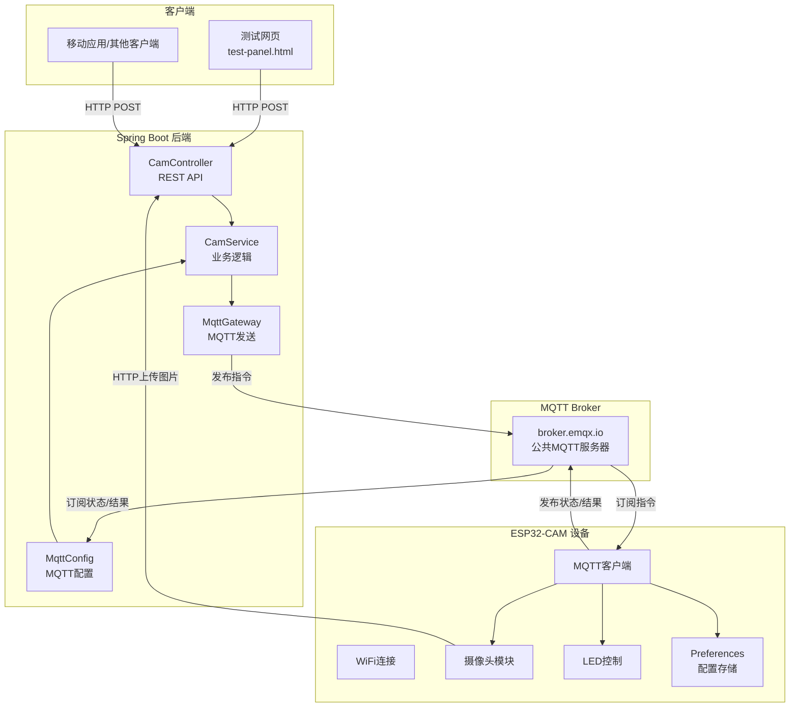

# ESP32-CAM MQTT 物联网项目架构详解

## 📋 项目概述

这是一个基于ESP32-CAM的智能摄像头物联网系统，通过MQTT协议实现远程控制，支持1080p拍照、视频流推送、LED控制、摄像头参数调整等功能。

### 核心特性

- 🎥 **1080p高清拍照** - 远程触发拍照并自动上传
- 📹 **多分辨率视频流** - 支持480p/720p/1080p切换
- 💡 **LED控制** - PWM亮度调节(0-255)
- 🎨 **摄像头参数调整** - 亮度、对比度、饱和度等
- ⚙️ **动态配置** - WiFi、MQTT、上传URL可远程修改
- 📊 **状态监控** - 实时上报设备运行状态

---

## 🏗️ 系统架构



---

## 📁 项目结构

### 1. ESP32-CAM 固件 (`CameraWebServer/`)

```
CameraWebServer/
├── CameraWebServer.ino     # 主程序（759行）
├── app_httpd.cpp           # HTTP视频流服务器（160行）
├── camera_pins.h           # 摄像头GPIO引脚定义
└── board_config.h          # 板型配置（AI-Thinker）
```

#### 核心代码解析

##### CameraWebServer.ino - 主程序

**1. 配置管理 (使用Preferences)**

```cpp
// 默认配置（首次启动）
#define DEFAULT_WIFI_SSID "2702"
#define DEFAULT_WIFI_PASS "18063328637"
#define DEFAULT_MQTT_SERVER "broker.emqx.io"
#define DEFAULT_MQTT_CLIENT "esp32cam"
#define DEFAULT_UPLOAD_URL "http://192.168.124.68:8080/mqtt/cam/upload"

// 运行时配置（从Flash加载或使用默认值）
String wifi_ssid;
String mqtt_server;
String upload_url;
Preferences preferences;  // ESP32持久化存储
```

**作用**: 
- 使用ESP32的NVS（非易失性存储）保存配置
- 断电后配置不丢失
- 可通过MQTT远程修改

**2. MQTT消息处理流程**

```cpp
void mqttCallback(char* topic, byte* payload, unsigned int length) {
    // 1. 接收MQTT消息
    // 2. 解析JSON {"id":123,"op":"capture","val":0}
    // 3. 调用handleCommand处理
}

void handleCommand(StaticJsonDocument<512>& doc) {
    long cmdId = doc["id"].as<long>();  // 关键：使用as<long>()
    const char* op = doc["op"];
    
    // 根据op类型分发：
    // - capture: 拍照上传
    // - led: LED控制
    // - set_wifi: WiFi配置
    // - framesize: 分辨率切换
    // ...
}
```

**cmdId处理**: 
- 使用`.as<long>()`显式转换（关键！）
- ESP32的long是32位，最大2,147,483,647
- 后端使用`generateCmdId()`生成10位数字

**3. 拍照与上传**

```cpp
void captureAndUpload(long cmdId) {
    // 1. 临时切换到1080p
    sensor_t *s = esp_camera_sensor_get();
    framesize_t old_framesize = s->status.framesize;
    s->set_framesize(s, FRAMESIZE_FHD);  // 1080p
    
    // 2. 拍照
    camera_fb_t *fb = esp_camera_fb_get();
    
    // 3. HTTP上传
    uploadImage(fb, cmdId);
    
    // 4. 恢复原分辨率
    esp_camera_fb_return(fb);
    s->set_framesize(s, old_framesize);
}
```

**关键点**:
- 拍照用1080p，视频流用720p
- 拍照完毕恢复原分辨率
- 使用独立WiFiClient避免与MQTT冲突

**4. HTTP图片上传**

```cpp
void uploadImage(camera_fb_t *fb, long cmdId) {
    // 1. 创建独立客户端（避免与MQTT冲突）
    WiFiClient httpClient;
    HTTPClient http;
    
    // 2. 构建文件名
    char fileName[64];
    snprintf(fileName, sizeof(fileName), "%s_%ld.jpg", 
             mqtt_client_id.c_str(), cmdId);
    
    // 3. 构建multipart/form-data
    String boundary = "----WebKitFormBoundary...";
    // body + 图片数据 + endBoundary
    
    // 4. 一次性POST上传
    int httpCode = http.POST(postData, totalLen);
}
```

**为什么用独立WiFiClient**: 
- MQTT使用`espClient`
- HTTP上传使用`httpClient`
- 避免连接冲突导致数据混乱

**5. LED PWM控制**

```cpp
// 初始化
#define LED_PIN 4
#define LED_PWM_FREQ 5000
#define LED_PWM_RESOLUTION 8  // 8位=0-255

ledcAttach(LED_PIN, LED_PWM_FREQ, LED_PWM_RESOLUTION);

// 控制
void controlLED(int value) {
    ledStatus = (value != 0);
    if (ledStatus) {
        ledcWrite(LED_PIN, ledBrightness);  // PWM调光
    } else {
        ledcWrite(LED_PIN, 0);
    }
}
```

**PWM原理**:
- 频率5000Hz
- 占空比0-255对应亮度
- GPIO 4连接LED

##### app_httpd.cpp - 视频流服务器

**核心功能**: 提供MJPEG视频流

```cpp
static esp_err_t stream_handler(httpd_req_t *req) {
    while (true) {
        // 1. 获取摄像头帧
        fb = esp_camera_fb_get();
        
        // 2. 发送MJPEG头
        httpd_resp_send_chunk(req, _STREAM_PART, strlen(_STREAM_PART));
        
        // 3. 发送JPEG数据
        httpd_resp_send_chunk(req, (const char *)fb->buf, fb->len);
        
        // 4. 发送边界
        httpd_resp_send_chunk(req, _STREAM_BOUNDARY, strlen(_STREAM_BOUNDARY));
        
        esp_camera_fb_return(fb);
    }
}
```

**访问**: `http://{ESP32_IP}/stream`

---

### 2. Spring Boot 后端 (`SpringbootIOT/`)

```
SpringbootIOT/
├── src/main/java/com/springboot/
│   ├── SpringbootApplication.java        # 启动类
│   ├── common/
│   │   └── Result.java                   # 统一返回类
│   ├── configuration/
│   │   ├── MqttConfig.java              # MQTT配置
│   │   ├── MqttGateway.java             # MQTT发送接口
│   │   └── Blocker.java                 # HTTP拦截器
│   ├── controller/
│   │   └── CamController.java           # REST API控制器
│   ├── service/
│   │   ├── CamService.java              # 服务接口
│   │   └── Impl/
│   │       └── CamServiceImpl.java      # 服务实现
│   ├── dto/                              # 请求参数DTO
│   │   ├── LedRequest.java
│   │   ├── WiFiConfigRequest.java
│   │   └── ...
│   ├── pojo/
│   │   ├── DeviceStatus.java           # 设备状态实体
│   │   └── ResultDto.java              # MQTT结果实体
│   ├── exception/
│   │   └── GlobalExceptionHandler.java # 全局异常处理
│   └── utils/
│       └── JsonUtil.java                # JSON工具类
├── src/main/resources/
│   └── application.yml                   # 配置文件
└── pom.xml                               # Maven依赖
```

#### 核心代码解析

##### 1. Result 统一返回类

```java
public class Result<T> {
    private Integer code;      // 0=成功
    private String message;
    private T data;
    private Long timestamp;
    
    // 静态工厂方法
    public static <T> Result<T> success(T data) {
        return new Result<>(0, "操作成功", data);
    }
    
    public static <T> Result<T> error(String message) {
        return new Result<>(500, message, null);
    }
}
```

**优势**:
- 统一API响应格式
- 泛型支持任意数据类型
- 自动添加时间戳

##### 2. MqttConfig - MQTT配置

```java
@Configuration
public class MqttConfig {
    // MQTT服务器地址
    @Value("${mqtt.url}")
    private String url;
    
    // 出站通道（发送指令到ESP32）
    @Bean
    @ServiceActivator(inputChannel = "cmdOutboundChannel")
    public MessageHandler cmdOutbound(MqttPahoClientFactory factory) {
        MqttPahoMessageHandler handler = 
            new MqttPahoMessageHandler("spring-cam-cmd", factory);
        handler.setAsync(true);
        return handler;
    }
    
    // 入站通道（接收ESP32消息）
    @Bean
    public MessageProducer inbound(MqttPahoClientFactory factory) {
        MqttPahoMessageDrivenChannelAdapter adapter =
            new MqttPahoMessageDrivenChannelAdapter("spring-cam-result", 
                factory, "cam/+/result", "cam/+/status");
        adapter.setOutputChannel(mqttInputChannel());
        return adapter;
    }
}
```

**消息流**:
1. Controller → Service → MqttGateway → cmdOutboundChannel → MQTT Broker
2. MQTT Broker → inbound → mqttInputChannel → CamServiceImpl.handle()

##### 3. CamController - REST API

```java
@RestController
@RequestMapping("/mqtt")
public class CamController {
    
    @PostMapping("/capture/{clientId}")
    public Result<String> capture(@PathVariable @NotBlank String clientId) {
        String cmdId = camService.triggerCapture(clientId);
        return Result.success("拍照指令已发送", cmdId);
    }
    
    @PostMapping("/led/{clientId}")
    public Result<String> led(
            @PathVariable @NotBlank String clientId,
            @RequestBody @Valid LedRequest request) {  // JSON Body
        String cmdId = camService.controlLed(clientId, request.getValue());
        return Result.success("LED控制指令已发送", cmdId);
    }
}
```

**关键变化**:
- 使用`@RequestBody`接收JSON
- 使用`@Valid`自动校验参数
- 返回类型统一为`Result<T>`

##### 4. CamServiceImpl - 业务逻辑

```java
@Service
public class CamServiceImpl implements CamService {
    
    // 设备状态缓存
    private final ConcurrentHashMap<String, DeviceStatus> deviceStatusCache = 
        new ConcurrentHashMap<>();
    
    // 生成短ID（32位long范围内）
    private long generateCmdId() {
        long timestamp = System.currentTimeMillis();
        int timePart = (int)(timestamp % 1000000);  // 后6位
        int randomPart = (int)(Math.random() * 10000);  // 4位随机
        return timePart * 10000L + randomPart;  // 10位数字
    }
    
    @Override
    public String triggerCapture(String clientId) {
        long id = generateCmdId();  // 5741231234
        String json = JsonUtil.toJson(
            Map.of("id", id, "op", "capture", "val", 0));
        mqttGateway.send("cam/" + clientId + "/cmd", json);
        return "cmd queued " + id;
    }
    
    // 接收ESP32消息
    @ServiceActivator(inputChannel = "mqttInputChannel")
    public void handle(Message<?> msg) {
        String topic = (String) msg.getHeaders().get(MqttHeaders.RECEIVED_TOPIC);
        String json = (String) msg.getPayload();
        
        if (topic.endsWith("/result")) {
            // 处理执行结果
            ResultDto r = JsonUtil.fromJson(json, ResultDto.class);
            log.info("指令{}执行完成", r.getId());
        } else if (topic.endsWith("/status")) {
            // 更新设备状态缓存
            DeviceStatus status = JsonUtil.fromJson(json, DeviceStatus.class);
            deviceStatusCache.put(status.getClientId(), status);
        }
    }
}
```

**cmdId生成关键**:
- `System.currentTimeMillis()` = 1733574123456 (13位)
- ESP32的long是32位 → **溢出！**
- 新方案：`574123 × 10000 + 1234` = `5741231234` (10位)
- 完全符合32位long范围

##### 5. 请求DTO - 参数校验

```java
@Data
public class LedRequest {
    @NotNull(message = "LED状态不能为空")
    @Min(value = 0, message = "LED状态必须为0或1")
    @Max(value = 1, message = "LED状态必须为0或1")
    private Integer value;
}

@Data
public class WiFiConfigRequest {
    @NotBlank(message = "SSID不能为空")
    @Size(min = 1, max = 32, message = "SSID长度必须在1-32字符之间")
    private String ssid;
    
    @NotBlank(message = "密码不能为空")
    @Size(min = 1, max = 64, message = "密码长度必须在1-64字符之间")
    private String password;
}
```

**自动校验**:
- 使用Bean Validation注解
- GlobalExceptionHandler统一处理校验异常
- 返回400错误和明确提示

##### 6. GlobalExceptionHandler - 异常处理

```java
@RestControllerAdvice
public class GlobalExceptionHandler {
    
    @ExceptionHandler(MethodArgumentNotValidException.class)
    public Result<Void> handleValidationException(
            MethodArgumentNotValidException e) {
        String message = e.getBindingResult()
            .getFieldError().getDefaultMessage();
        return Result.error(400, message);
    }
}
```

**统一错误响应**:
```json
{
  "code": 400,
  "message": "LED状态必须为0或1",
  "data": null,
  "timestamp": 1733574123456
}
```

---

### 3. 测试页面 (`test-panel.html`)

**技术栈**: 纯HTML + CSS + JavaScript

**核心功能**:
```javascript
// API调用封装
async function apiCall(url, method = 'POST', body = null) {
    const options = { method };
    if (body) {
        options.headers = { 'Content-Type': 'application/json' };
        options.body = JSON.stringify(body);  // JSON Body
    }
    const response = await fetch(url, options);
    return await response.json();
}

// LED控制示例
async function ledControl(value) {
    await apiCall(`${getBaseUrl()}/mqtt/led/${getClientId()}`, 
        'POST', {value});  // {"value": 1}
}

// 视频流显示
function startStream() {
    const ip = document.getElementById('esp32Ip').value;
    document.getElementById('videoStream').src = 
        `http://${ip}/stream?t=${Date.now()}`;
}
```

**设备状态可视化**:
- 自动解析status JSON
- 计算WiFi信号强度并分级显示
- 格式化运行时间（时分秒）
- 每10秒自动刷新

---

## 🔄 完整数据流示例

### 场景1: 远程拍照

```
1. 用户点击"拍照"按钮
   ↓
2. test-panel.html
   POST /mqtt/capture/esp32cam
   ↓
3. CamController.capture()
   ↓
4. CamServiceImpl.triggerCapture()
   生成cmdId: 5741231234
   ↓
5. MqttGateway.send()
   Topic: cam/esp32cam/cmd
   Payload: {"id":5741231234,"op":"capture","val":0}
   ↓
6. MQTT Broker (broker.emqx.io)
   ↓
7. ESP32订阅cam/esp32cam/cmd
   ↓
8. mqttCallback() → handleCommand()
   解析: id=5741231234, op=capture
   ↓
9. captureAndUpload(5741231234)
   - 切换1080p
   - esp_camera_fb_get()
   - uploadImage(fb, 5741231234)
   ↓
10. HTTP POST图片
    URL: http://192.168.124.68:8080/mqtt/cam/upload
    FileName: esp32cam_5741231234.jpg
    ↓
11. CamController.upload()
    保存到: photos/esp32cam_5741231234.jpg
    ↓
12. ESP32发布结果
    Topic: cam/esp32cam/result
    Payload: {"id":5741231234,"ok":true,"info":"Upload success"}
    ↓
13. CamServiceImpl.handle()
    日志: 指令5741231234执行完成
```

### 场景2: 设备状态上报

```
1. ESP32每30秒自动上报
   ↓
2. publishStatus()
   Topic: cam/esp32cam/status
   Payload: {
     "clientId":"esp32cam",
     "uptime":1234,
     "freeHeap":152536,
     "rssi":-43,
     "ledStatus":false,
     "ledBrightness":255,
     "framesize":13
   }
   ↓
3. CamServiceImpl.handle()
   ↓
4. 更新deviceStatusCache
   deviceStatusCache.put("esp32cam", status)
   ↓
5. 用户查询状态
   GET /mqtt/status/esp32cam
   ↓
6. CamServiceImpl.getDeviceStatus()
   从cache读取并计算online状态
   ↓
7. 返回Result
   {
     "code":0,
     "data":{
       "online":true,
       "uptime":"1234",
       "rssi":-43,
       ...
     }
   }
```

---

## 🔧 关键技术点

### 1. ESP32 32位long限制

**问题**: Java的`System.currentTimeMillis()`返回13位数字，超出ESP32 32位long范围

**解决**:
```java
// Java端
private long generateCmdId() {
    long timestamp = System.currentTimeMillis();  // 1733574123456
    int timePart = (int)(timestamp % 1000000);    // 574123
    int randomPart = (int)(Math.random() * 10000); // 1234
    return timePart * 10000L + randomPart;         // 5741231234
}

// ESP32端
long cmdId = doc["id"].as<long>();  // 正确解析
```

### 2. HTTP与MQTT连接隔离

```cpp
// MQTT客户端（全局）
WiFiClient espClient;
PubSubClient mqttClient(espClient);

// HTTP客户端（局部）
void uploadImage() {
    WiFiClient httpClient;  // 独立客户端
    HTTPClient http;
    http.begin(httpClient, upload_url);  // 避免冲突
}
```

### 3. 摄像头重影问题

**原因**: 双缓冲+GRAB_LATEST获取到旧帧

**解决**:
```cpp
config.fb_count = 1;  // 单缓冲
config.grab_mode = CAMERA_GRAB_WHEN_EMPTY;  // 等待新帧
```

### 4. 动态配置持久化

```cpp
// ESP32 Preferences（类似Android SharedPreferences）
Preferences preferences;

void saveWiFiConfig(String ssid, String pass) {
    preferences.begin("esp32cam", false);  // 读写模式
    preferences.putString("wifi_ssid", ssid);
    preferences.putString("wifi_pass", pass);
    preferences.end();
    ESP.restart();  // 重启应用新配置
}

void loadConfig() {
    preferences.begin("esp32cam", true);  // 只读模式
    wifi_ssid = preferences.getString("wifi_ssid", DEFAULT_WIFI_SSID);
    preferences.end();
}
```

**存储位置**: ESP32片上Flash的NVS分区，断电不丢失

---

## 📊 性能指标

| 指标 | 数值 |
|------|------|
| 1080p拍照时间 | ~2-3秒 |
| 图片大小 | 150-250KB |
| HTTP上传速度 | ~100KB/s |
| 720p视频流帧率 | 15-25 FPS |
| MQTT延迟 | <100ms |
| ESP32内存占用 | ~150KB空闲 |
| 设备启动时间 | ~5-10秒 |

---

## ✅ 总结

**技术栈**:
- **ESP32固件**: C++, Arduino, ESP-IDF
- **后端**: Spring Boot 3.5, MQTT, MyBatis-Plus
- **前端**: HTML5, CSS3, JavaScript ES6
- **通信**: MQTT (指令), HTTP (图片/视频)
- **存储**: NVS (ESP32), FileSystem (后端)

**设计亮点**:
- 📡 MQTT轻量级通信
- 🔐 参数校验与异常处理
- 💾 动态配置持久化
- 📊 实时状态监控
- 🎨 美观的测试界面
- 🔧 完善的文档体系

这是一个完整的物联网系统，涵盖了设备端、服务端、客户端三层架构！
